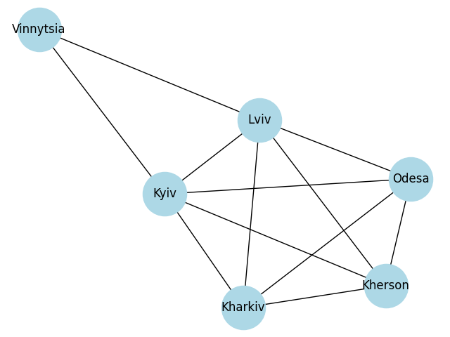

# goit-algo-hw-06

## task1

## task2
Список суміжності:
  Kyiv: ['Kharkiv', 'Kherson', 'Lviv', 'Odesa', 'Vinnytsia']
  Kharkiv: ['Kherson', 'Kyiv', 'Lviv', 'Odesa']
  Kherson: ['Kharkiv', 'Kyiv', 'Lviv', 'Odesa']
  Odesa: ['Kharkiv', 'Kherson', 'Kyiv', 'Lviv']
  Lviv: ['Kharkiv', 'Kherson', 'Kyiv', 'Odesa', 'Vinnytsia']
  Vinnytsia: ['Kyiv', 'Lviv']

Пошук шляху з Kyiv до Odesa:
Шлях DFS: Kyiv -> Kharkiv -> Kherson -> Lviv -> Odesa
Шлях BFS: Kyiv -> Odesa

--- Порівняння та пояснення ---
Алгоритми знайшли різні шляхи.

**Різниця в отриманих шляхах:**
  DFS знайшов шлях: Kyiv -> Kharkiv -> Kherson -> Lviv -> Odesa
  BFS знайшов шлях: Kyiv -> Odesa

**Чому шляхи саме такі?**
  1. **Алгоритм DFS:**
     - DFS досліджує якомога далі вздовж кожної гілки перед тим, як повертатися назад.
     - Через це, знайдений DFS шлях часто не є найкоротшим. Його шлях залежить від порядку обходу сусідів (ми відсортували їх для детермінованості) та структури графа.
     - У даному випадку, при пошуку з Kyiv до Odesa, DFS рухався по першому доступному сусіду до максимально можливої глибини, перш ніж розглядати інші варіанти. (Наприклад, Kyiv -> Kharkiv -> Odesa, якщо Kharkiv був першим в списку суміжності Kyiv, а Odesa першим в Kharkiv)

  2. **Алгоритм BFS (Breadth-First Search - Пошук у ширину):**
     - BFS досліджує всі вершини на поточному рівні (відстані від початкової вершини), перш ніж перейти до вершин наступного рівня.
     - Отже, шлях, знайдений BFS з Kyiv до Odesa, є найкоротшим можливим за кількістю ребер.

## task3

Граф з вагами (відстанями в км):
  Kyiv -- Kharkiv: 479 км
  Kyiv -- Kherson: 540 км
  Kyiv -- Odesa: 475 км
  Kyiv -- Lviv: 540 км
  Kyiv -- Vinnytsia: 270 км
  Kharkiv -- Kherson: 565 км
  Kharkiv -- Odesa: 570 км
  Kharkiv -- Lviv: 790 км
  Kherson -- Odesa: 200 км
  Kherson -- Lviv: 900 км
  Odesa -- Lviv: 790 км
  Lviv -- Vinnytsia: 360 км

============================================================
--- Застосування алгоритму Дейкстри до зваженого графа ---
Знаходження найкоротших відстаней від кожного міста до інших:

Найкоротші відстані від "Kyiv":
Вершина              Відстань
-----------------------------------
Kyiv                 0 км
Kharkiv              479 км
Kherson              540 км
Odesa                475 км
Lviv                 540 км
Vinnytsia            270 км

Найкоротші відстані від "Kharkiv":
Вершина              Відстань
-----------------------------------
Kyiv                 479 км
Kharkiv              0 км
Kherson              565 км
Odesa                570 км
Lviv                 790 км
Vinnytsia            749 км

Найкоротші відстані від "Kherson":
Вершина              Відстань
-----------------------------------
Kyiv                 540 км
Kharkiv              565 км
Kherson              0 км
Odesa                200 км
Lviv                 900 км
Vinnytsia            810 км

Найкоротші відстані від "Odesa":
Вершина              Відстань
-----------------------------------
Kyiv                 475 км
Kharkiv              570 км
Kherson              200 км
Odesa                0 км
Lviv                 790 км
Vinnytsia            745 км

Найкоротші відстані від "Lviv":
Вершина              Відстань
-----------------------------------
Kyiv                 540 км
Kharkiv              790 км
Kherson              900 км
Odesa                790 км
Lviv                 0 км
Vinnytsia            360 км

Найкоротші відстані від "Vinnytsia":
Вершина              Відстань
-----------------------------------
Kyiv                 270 км
Kharkiv              749 км
Kherson              810 км
Odesa                745 км
Lviv                 360 км
Vinnytsia            0 км

============================================================
--- Приклад знаходження конкретного найкоротшого шляху ---

Найкоротший шлях з Kyiv до Kherson:
  Шлях: Kyiv -> Kherson
  Довжина шляху: 540 км

Найкоротший шлях з Lviv до Kharkiv:
  Шлях: Lviv -> Kharkiv
  Довжина шляху: 790 км